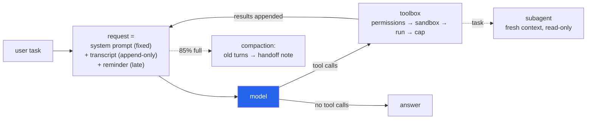

<h1 align="center">harness-agent-scratch (Python · Ollama · OpenAI API · LLM tool calling)</h1>
<p align="center"><i>A coding agent built from one API call upwards: no framework, no SDK, no dependencies, and a model that runs on the CPU</i></p>

<p align="center">
  <a href="#the-through-line">The through-line</a> &middot;
  <a href="#build-steps">Build steps</a> &middot;
  <a href="#input">Input</a> &middot;
  <a href="#output">Output</a> &middot;
  <a href="#quick-start">Quick start</a> &middot;
  <a href="#what-this-repo-does-not-do">What it does NOT do</a> &middot;
  <a href="#problems-hit-while-building-this">Problems hit</a>
</p>

<p align="center">
  <a href="https://github.com/hammasbuilds/harness-agent-scratch/actions/workflows/ci.yml"></a>
  
  
  
  
  
  <a href="LICENSE"></a>
</p>

---

## The through-line



A coding agent is **an LLM called in a loop, plus a harness**. The model decides; the harness
does everything else. This repo builds that harness in plain Python, one concept per module,
following the order of a from-scratch tutorial: chat → bash tool → file tools → agent loop →
prefix-cache layout → skills → late injection → todos → permissions and sandbox → output capping →
compaction → subagents.

> Nothing here trains a model. Every capability is context engineering: what goes into the
> request, in what order, and what comes back out.

The one rule that shapes the whole layout is **never change the start of the request**. Providers
(and Ollama, for a loaded model) reuse the computation for a prefix they have already seen. On a
CPU that is the difference between, say, re-reading a 6,000-token transcript every step and reading
only the 200 new tokens. So the
system prompt is fixed for the session, the transcript is append-only, and everything that
changes (date, git branch, todo list, files edited behind the agent's back) is injected **at the
end** and never stored. [`test_the_request_prefix_never_changes_within_a_turn`](tests/test_agent.py)
asserts that each request starts with the previous one.

## Build steps

| | Step | Tests | What it does |
|---|---|---|---|
| 01 | [Model call](harness/llm.py) | 49 | One POST per call with `urllib`. Two backends, one `Reply`: Ollama's native `/api/chat` (the only Ollama endpoint that takes `num_gpu`/`num_ctx` per request) and any OpenAI-compatible `/chat/completions` (OpenRouter, DeepSeek, …). Retries rate limits, 5xx and dropped connections (not timeouts: on a CPU a timeout already cost minutes). The timeout covers the whole response, not each read. Flags replies cut off at the output limit; a reply in the wrong JSON shape is an error, not a crash. Recovers tool calls a model wrote as text. |
| 02 | [Tools](harness/tools.py) | 77 | `bash`, `read_file`, `write_file`, `str_replace`, `read_skill`, `write_todos`, `task`. Arguments checked against the schema, types included; every failure goes back to the model as text instead of ending the loop. Edits keep a file's encoding (UTF-8, UTF-16 LE/BE, Latin-1) and line endings (LF, CRLF or mixed) byte for byte outside the edited text. `.git` is blocked at any depth; `.env`, `.agents/`, `.harness/` and credentials files need a yes. |
| 03 | [Agent loop](harness/agent.py) | 28 | `while` the model asks for tools: run them, append the results as `role: tool`, call again. Ctrl-C mid-tool still leaves every call with a result; a model repeating one call is told so. |
| 04 | [Skills](harness/skills.py) | 9 | Finds `SKILL.md` under `~/.agents/skills` and `<workspace>/.agents/skills`; only name + description enter the system prompt, the body loads on demand, and files in a skill's folder are readable without a prompt. |
| 05 | [Late injection](harness/context.py) | 14 | Date, git branch/commit, todo list and stale-file warnings, added after the transcript in a `<system-reminder>`. |
| 06 | [Todos](harness/todos.py) | ↑ | The model rewrites the whole list each time; one item `in_progress` at a time. |
| 07 | [Permissions](harness/permissions.py) | 152 | An allowlist, not a list of dangers. Runs without asking only: bare names of programs that have no writing or executing option at all (`sort`, `file`, `tree`, `date` are left out; `./ls` asks); `git` only as `git <read-only subcommand>` with no global options or `:` pathspecs, in a repository that is the workspace; no `$`, braces or unknown operators; every path-like argument (glued to a flag, after a `:`, through globs and symlinks) inside the workspace and not a credentials file; recursive readers only when the workspace holds no credentials. |
| 08 | [Sandbox](harness/sandbox.py) | 12 | Linux: bubblewrap with a read-only root, private `/tmp` and `/run`, no network, own PID namespace. macOS: Seatbelt, writes only in the workspace and system temp folders, no network. Windows: none, and the CLI says so. |
| 09 | [Output capping](harness/tools.py) | ↑ | Results over 3,000 characters are cut; the full text goes to `.harness/spill/` for `head`/`grep`, and is deleted when the turn ends. A command's output is held to its first and last 1M characters. Commands run without credential variables in their environment. |
| 10 | [Compaction](harness/compaction.py) | 12 | Counts everything sent (system prompt, ~900 tokens of tool schemas, reminder, transcript). At 85% of the limit, finished turns become a capped, model-written handoff note; if the current turn alone is too big, its tool outputs are cut, oldest first. |
| 11 | [Subagents](harness/subagent.py) | ↑ | `task` starts a fresh context with its own read-only toolbox: commands that would need a yes are refused, never asked. Its budget forces an answer before it overflows. Only its final answer returns. One level deep. |
| 12 | [CLI](harness/cli.py) + [config](harness/config.py) | 34 | `harness` REPL or `harness -p "task"`. Settings from flags, the environment, `~/.config/harness/.env`, then the project's `.env`, which may set only temperature and compaction thresholds. Approval prompts show control characters as escapes. |

`↑` = covered by the test file of the row above (todos with context, capping with tools,
subagents with the agent loop).

## Why the model runs on the CPU

This machine's GPU is busy training for days. Ollama by default loads a model onto the GPU when
there is room, which could push a training job out of memory. So the harness sends
`options.num_gpu = 0` with **every** request (default, set by `HARNESS_NUM_GPU`), and `num_thread =
6` to leave cores for the training job's data loading. When the GPU is free, set
`HARNESS_NUM_GPU=99` and nothing else changes.

On CPU the prefix-cache layout stops being an optimisation and becomes what makes the agent
usable at all: reading the prompt, not generating the answer, is the slow part.

## Input

The task given to [`demo.py`](demo.py):

```text
Create fib.py that prints the first 10 Fibonacci numbers on one line, run it,
then change it to print 15 and run it again. Keep a todo list.
```

## Output

`python demo.py --scripted`. **The model's replies here are pre-written**, because no inference was
run while building this repo. Every tool call below really executed: the file was written, Python
ran it, the edit was applied, and the subagent read the file in its own context.

```text
model: scripted replies (no model)
sandbox: none: bash commands run with your full user rights

> write_todos {"todos": [{"content": "write fib.py", "status": "in_progress"}, ...]}
  [>] write fib.py
  [ ] run it
  [ ] change to 15 and rerun
> write_file {"path": "fib.py", "content": "a, b = 0, 1\nout = []\nfor _ in range(10): ..."}
  wrote 91 characters to fib.py
> bash {"command": "python fib.py"}
  [permission] run: python fib.py -> approved by demo.py
  0 1 1 2 3 5 8 13 21 34
  [exit code 0]
> str_replace {"path": "fib.py", "old_string": "range(10)", "new_string": "range(15)"}
  replaced 1 occurrence(s) in fib.py
> bash {"command": "python fib.py"}
  [permission] run: python fib.py -> approved by demo.py
  0 1 1 2 3 5 8 13 21 34 55 89 144 233 377
  [exit code 0]
> task {"prompt": "Read fib.py in the workspace and say in one sentence what it prints."}
  [subagent started]
  [subagent] > read_file {"path": "fib.py"}
  [subagent finished]
  fib.py prints the first 15 Fibonacci numbers, space-separated, on one line.
> write_todos {...}
  [x] write fib.py
  [x] run it
  [x] change to 15 and rerun
```

`python demo.py` (without `--scripted`) runs the same task against the configured model. Its
output is not recorded here yet; see [What this repo does NOT do](#what-this-repo-does-not-do).

## Quick start

```bash
pip install -e .                                       # no runtime dependencies
mkdir -p ~/.config/harness
cp .env.example ~/.config/harness/.env                 # pick a backend and model

harness                            # interactive session in the current folder
harness -p "add a --verbose flag to cli.py" -w path/to/project
python demo.py --scripted          # the mechanics, with no model at all
```

Local model (default): Ollama running, `ollama pull qwen2.5:7b-instruct`. Hosted model:
`HARNESS_BACKEND=openai`, `HARNESS_BASE_URL`, `HARNESS_API_KEY`, `HARNESS_MODEL`.

Where settings come from, strongest first: command-line flags, the environment,
`~/.config/harness/.env` (or the file `HARNESS_CONFIG` names), then the project's own `.env`.
The project's `.env` is an allowlist: it may set only `HARNESS_TEMPERATURE`, `HARNESS_COMPACT_AT` and
`HARNESS_COMPACT_TO`. It can come from a cloned repository, or be written by the model after one
approval, so it may not choose where requests go (a base URL there would send your real API key
elsewhere), what runs commands, the sandbox, the model, `HARNESS_NUM_GPU` (which keeps the model off a
GPU a training job is using), or step counts and context size (which multiply a paid session's cost).
Other `HARNESS_` lines there are ignored with a warning.

Choosing a local model: **`qwen2.5:7b-instruct`** on CPU; `qwen2.5:14b-instruct` when a GPU is
free. Avoid `qwen2.5-coder` as the main agent under Ollama: it tends to print the tool call as JSON
text instead of using the tool-call field. [`extract_inline_tool_calls`](harness/llm.py) recovers
that case, but a model that uses the field properly is more reliable.

REPL commands: `/todos`, `/tokens`, `/clear`, `/exit`.

## Layout

```text
harness/
  llm.py          model backends (Ollama native, OpenAI-compatible), Reply, ScriptedLLM
  agent.py        the loop, request layout, tool-output trimming, compaction trigger
  tools.py        toolbox: schemas, validation, file tools, bash, output cap
  permissions.py  allow / ask / deny for shell commands
  sandbox.py      bubblewrap / Seatbelt wrapping, shell discovery (Git Bash on Windows)
  skills.py       SKILL.md discovery and front matter
  context.py      late-injected reminder: date, git, todos, stale files
  todos.py        the todo list
  compaction.py   token estimate, safe cut point, handoff note
  subagent.py     isolated read-only sub-loop
  config.py       HARNESS_* settings and .env
  cli.py          terminal front end
demo.py           one task in a throwaway folder (--scripted for no model)
tests/            387 tests; scripted model, real tools
```

## Requirements

- Python 3.10+. No runtime dependencies (`urllib`, `subprocess`, `shlex` from the standard library).
- A model: Ollama locally, or any OpenAI-compatible endpoint. The model must support tool calling.
- Windows: Git for Windows (its `bash.exe` runs the `bash` tool; `cmd.exe` is the fallback).
  `C:\Windows\System32\bash.exe` is WSL and is deliberately never picked, because it sees a
  different filesystem.

## Tests

```bash
pip install -e ".[dev]"
pytest -q
```

387 tests, about 45 seconds (one, following a symlink, is skipped on Windows accounts that cannot create symlinks). No network, no model, no GPU: a `ScriptedLLM` replays pre-written
replies while the tools really run: files are written, `bash` really executes, subagents really run
their own loop. HTTP handling is tested against a local `http.server` stub. The suite was also run
in a fresh virtualenv holding only pytest, with `HOME` pointed at an empty folder, so it does not
depend on this machine's skills, Ollama models or environment.

## What this repo does NOT do

- **No live model run yet.** This repo was built without running inference, and no
  model-in-the-loop result is recorded. Whether `qwen2.5:7b-instruct` on CPU finishes the demo task,
  and how long it takes, is still unmeasured.
- **No sandbox on Windows.** Permission prompts are the only guard there, and they are not
  security: `python -c "import shutil; shutil.rmtree(...)"` is just a command that asks. Run it in
  WSL or a container for real isolation.
- **The Linux and macOS sandboxes are unit-tested for the command they build, not run.** The
  bubblewrap arguments and the Seatbelt profile have not been exercised on a Linux or Mac machine.
- **The permission classifier is a filter, not a parser of bash.** Three independent reviews each
  found ways past earlier versions, which is why it is now an allowlist; a fourth might still find
  one. It errs towards asking: a grep pattern like `/api/`, `git -C sub log`, `find -name '.*'` and
  a recursive grep in a workspace holding a `.env` all ask. Approved commands run with your rights.
- No streaming output, no web search or browser tool, no parallel subagents, no image input.
- Token counts for compaction are estimated (characters ÷ 3, deliberately pessimistic), not
  tokenised.

## Problems hit while building this

After the first build, three independent reviewers in turn attacked the code, each without seeing
the others' reports. They scored the successive versions 64, 64 and 67 out of 100 and proved every
finding with a probe; each one below was reproduced, fixed and pinned by a test.

- **`ls # list` + newline + `rm -f important.txt` deleted the file without asking.** `shlex`
  treats `#` as a comment to the end of the string, so the classifier never saw the `rm`; bash does
  not. Comments are now off in the lexer.
- **`cat $HOME/.gitconfig` read outside the workspace without asking**, because the path check
  looked at the literal token. Anything with `$` now asks, and commands run without credential
  variables in their environment (`echo $GITHUB_TOKEN` printed the real token before).
- **A second reviewer, then a probe of 50 shell tricks, found four more ways past the approver.**
  `cat a|&rm a` ran `rm`: `|&` (pipe with stderr) was read as an argument. Brace expansion
  (`cat {../secret,x}`), a path glued to a flag (`grep -f../secret`) and a glob or symlink leading
  out of the workspace (`cat li*/secret`) all read outside it. Unknown operators, braces and
  hidden-file globs now ask; globs are expanded and symlinks resolved before the check.
- **The third reviewer walked past it six more ways, and the design changed.** `./ls` ran a script
  the model had just written; `git --namespace log commit` committed (the subcommand was taken to be
  the first word without a dash); `sort --outp=x`, `file -zC` and `tree -ao` wrote files through
  abbreviated or bundled flags; `git show HEAD:.env`, `grep -f.env` and `grep -r KEY .` read
  credentials. Patching each hole had not converged, so the classifier became an allowlist: bare
  program names only, and only programs with no writing or executing option at all.
- **An emoji in a commit subject ended the session.** `git_summary` decoded git's UTF-8 output with
  the Windows locale codec (cp1252) and crashed; so did printing "✓" to a redirected stdout.
- **The request timeout was per socket read.** A server sending one byte every 0.3 s kept a
  1.5-second request alive for 10 s; the first fix still blocked in `read(65536)`, which waits for
  64 KB, until it became `read1`.
- **The token budget ignored ~900 tokens of tool schemas.** With an 8,192-token Ollama context,
  compaction would have triggered only after the real prompt had overflowed, and Ollama drops the
  start of an overlong prompt (the system prompt) without an error.
- **Compaction could summarise away the user's own request.** With only one turn in the transcript,
  the cut fell back to "any non-tool message" inside the current turn. Only finished turns are cut
  now; an oversized current turn has its tool outputs shortened instead.
- **One step spawned `git` a dozen times.** Every token estimate rebuilt the reminder, and every
  reminder ran `git` twice, about 100 ms each on Windows. Now once per step; the suite went from 68 s
  to 23 s.
- **Editing a Latin-1 file replaced every `é` with U+FFFD**, and `write_file` wrote `\r\r\n` over a
  CRLF file. Files are now decoded strictly (UTF-8, BOM-marked UTF-16/UTF-8, else byte-exact
  Latin-1) and written back in the same encoding and line-ending style.
- **Ctrl-C during a tool left a tool call with no result**, which hosted APIs reject on every later
  request of the session. Unfinished calls now get an "interrupted" result.
- **A timed-out command never returned on Windows.** `subprocess.run(timeout=1)` killed Git
  Bash, but its child `sleep` kept the output pipes open, and reading them blocked until the child
  exited by itself: 5 seconds for `sleep 5`, forever for a dev server. The fix kills the whole
  process tree (`taskkill /T` on Windows, a process group on POSIX).
  [`test_timeout`](tests/test_tools.py) pins it.
- **`call("read_skill", name="pdf")` raised `TypeError`.** The scripted-call helper's first
  parameter was called `name`, and `read_skill`'s own argument is also `name`. The tool name is now
  positional-only.
- **`git rev-parse --abbrev-ref HEAD` fails in a repo with no commits**, so a brand-new project
  looked like "not a git repository". `git symbolic-ref --short HEAD` works there; `rev-parse`
  remains the fallback for a detached HEAD.
- **Line endings.** Python on Windows turns `\n` into `\r\n` when writing text, so an edit would
  have rewritten every line of an LF file, and the model's `\n`-separated `old_string` would never
  match inside a CRLF file. Files are read and written with `newline=""`, matched with `\n`, and
  written back in their original style.

## Keywords

coding agent &middot; agent harness &middot; agent loop &middot; tool calling &middot; function calling &middot;
context engineering &middot; prefix caching &middot; prompt caching &middot; late injection &middot; skills &middot;
SKILL.md &middot; todo list &middot; permissions &middot; sandbox &middot; bubblewrap &middot; seatbelt &middot;
compaction &middot; subagents &middot; Ollama &middot; OpenRouter &middot; OpenAI-compatible API &middot; CPU inference &middot;
qwen2.5 &middot; from scratch &middot; no framework

## License

MIT, see [LICENSE](LICENSE).
