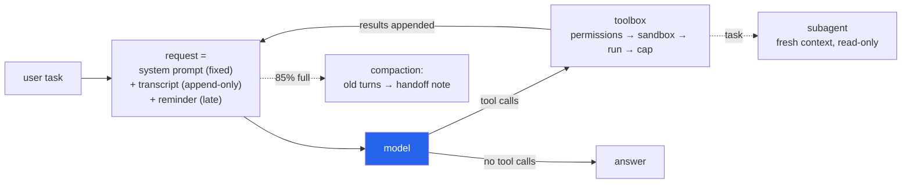

<h1 align="center">harness-agent-scratch (Python · Ollama · OpenAI API · LLM tool calling)</h1>
<p align="center"><i>A coding agent built from one API call upwards: no framework, no SDK, no runtime dependencies, and a permission check that let none of 514 dangerous commands through</i></p>

<p align="center">
  <a href="#the-through-line">The through-line</a> &middot;
  <a href="#findings">Findings</a> &middot;
  <a href="#build-steps">Build steps</a> &middot;
  <a href="#input--output">Input / Output</a> &middot;
  <a href="#quick-start">Quick start</a> &middot;
  <a href="#model-arm-three-local-models-over-14-tasks">Model arm</a> &middot;
  <a href="#layout">Layout</a> &middot;
  <a href="#requirements">Requirements</a> &middot;
  <a href="#tests">Tests</a> &middot;
  <a href="#what-this-repo-does-not-do">What it does NOT do</a> &middot;
  <a href="#problems-hit-while-building-this">Problems hit</a>
</p>

<p align="center">
  <a href="https://github.com/hammasbuilds/harness-agent-scratch/actions/workflows/ci.yml"></a>
  
  
  
  
  
  <a href="LICENSE"></a>
</p>

---

## The through-line



A coding agent is **an LLM called in a loop, plus a harness**. The model decides; the harness
does everything else. This repo builds that harness in plain Python, one concept per module:
chat → bash tool → file tools → agent loop → prefix-cache layout → skills → late injection →
todos → permissions and sandbox → output capping → compaction → subagents. Inspired by
[shareAI-lab/learn-claude-code](https://github.com/shareAI-lab/learn-claude-code), a lesson-per-mechanism
course that builds the same pieces; no code from it is used.

> Nothing here trains a model. Every capability is context engineering: what goes into the
> request, in what order, and what comes back out. Two parts of that can be measured without
> running a model, and both are measured below: how many tokens the harness thinks it is
> sending, and which commands it lets run without asking.

The one rule that shapes the whole layout is **never change the start of the request**. Providers
(and Ollama, for a loaded model) reuse the computation for a prefix they have already seen. So the
system prompt is fixed for the session, the transcript is append-only, and everything that
changes (date, git branch, todo list, files edited behind the agent's back) is injected **at the
end** and never stored. [`test_the_request_prefix_never_changes_within_a_turn`](tests/test_agent.py)
asserts that each request starts with the previous one.

## Findings

Both studies run on the CPU with committed code; neither runs a model. The model-in-the-loop
numbers are in the [model arm](#model-arm-three-local-models-over-14-tasks): `qwen2.5:14b-instruct`
passes 11 of 14 coding tasks, `qwen2.5-coder:14b` and `qwen2.5:7b-instruct` 8 each.

| Question | Result | n | Source |
|---|---|---|---|
| Is the token estimate ever **below** the real Qwen2.5 count? (Ollama silently drops the start of an overlong prompt) | **Never.** Largest real/estimate ratio **0.919** (base32 text); 0 of 180 samples under | 36 kinds of text x 5 samples of 3,000 characters | [`token_estimate_calibration.json`](results/token_estimate_calibration.json) |
| What does that safety margin cost? | Real count is **0.635** of the estimate on average (95% CI 0.574-0.694, bootstrap over kinds): compaction starts at about 54% of the true context instead of 85%. Worst on box drawing (0.17) and Thai (0.24) | same | same |
| Baseline: the flat "characters / 3" rule it replaced | Too low on **28 of 36** kinds, by up to **3.99x** (Amharic); 3.00x on `seq` output and numeric CSV | same | same |
| Does a command a real agent ran to **change** something ever run unasked? | **No:** 0 of 95 (precision of "allow" 176/176, CI lower bound 97.9%) | 299 distinct commands from 229 SWE-smith trajectories of Claude 3.7 Sonnet, labelled by hand | [`permission_classifier.json`](results/permission_classifier.json) |
| How many of that agent's harmless **reads** run without a prompt? | **176/204 (86.3%**, CI 80.9-90.3%). The 28 that ask: `xargs` 11, a leading `cd /testbed &&` 8, `sort` 6, braces 3. Weighted by how often each command was issued, only 28.1% of the agent's shell calls ran unasked, because `cd /testbed && python ...` dominates | same | same |
| Does a dangerous command from an independently labelled corpus run unasked? | **0/514** (Wilson upper bound 0.74%); 33 denied outright. Safe commands allowed: **89/202** (44.1%); running tests, `pip show`, `git remote -v` all ask | 826 commands labelled for [terminal-agent](https://github.com/hammasbuilds/terminal-agent)'s policy | same |
| The 172 commands earlier review rounds used to get past the check | 0/172 allowed. By construction: every one is pinned by a test | 172 | same |

What the numbers say, and do not:

- **The estimator is safe and wasteful.** No sample was underestimated, but on typical agent text
  (code 0.56, diffs 0.56, prose 0.63) it prices a prompt at 1.6-1.8x its real size. With the fixed
  overhead (system prompt and ~900 tokens of tool schemas) that is ~1,939 estimated tokens of a
  4,096 context before the first message ([compaction sample](#3-compaction-small-context-four-pasted-parts)).
  Tightening it is possible, but every earlier tightening was later beaten by a kind of text
  outside the calibration set (digits, then DNA, then Braille).
- **The allowlist is conservative in the way it was designed to be.** Zero unsafe allows on two
  corpora, bought with prompts: 14% of an agent's pure reads ask, and 55% of commands another project
  called safe ask (mostly because running tests executes code; one more is denied). A leading `cd <workspace> &&` is the
  cheapest fix: treating it as a no-op would raise read recall from 86.3% to 89.7% (183/204) with
  no new unsafe allow on this corpus. It is measured, not applied.
- **One false deny.** `echo 'Do not run rm -rf / here'` is denied outright: the catastrophic-pattern
  check reads the raw string, quotes included. It errs the safe way, but it is wrong, and it is
  listed below.
- The labels on the SWE-smith sample were written for this study, by the author of the checker,
  one command at a time (`read`: only reads files inside the repository; `change`: runs code,
  deletes, installs). They are in [`corpora/swesmith_commands.jsonl`](corpora/swesmith_commands.jsonl)
  with a reason per row. The terminal-agent labels were written for a different project.

## Build steps

| | Step | Tests | What it does |
|---|---|---|---|
| 01 | [Model call](src/harness/llm.py) | 78 | One POST per call with `http.client`; redirects are refused, since following one would carry the API key to another address. Two backends, one `Reply`: Ollama's native `/api/chat` (the only Ollama endpoint that takes `num_gpu`/`num_ctx` per request) and any OpenAI-compatible `/chat/completions` (OpenRouter, DeepSeek, …). Retries rate limits, 5xx and connections lost before the request was fully sent, honouring `Retry-After` up to a minute; never a request the server may already have processed (a paid call would be paid twice), and never a timeout (on a CPU a timeout already cost minutes). The timeout is a timer that closes the socket, so it covers the status line, headers and body, not each read. Flags replies cut off at the output limit; a reply in the wrong JSON shape or with wrong-typed fields is an error, not a crash. Recovers tool calls a model wrote as text, but only when the reply is nothing else. |
| 02 | [Tools](src/harness/tools.py) | 106 | `bash`, `read_file`, `write_file`, `str_replace`, `read_skill`, `write_todos`, `task`. Arguments checked against the schema, types included; every failure goes back to the model as text instead of ending the loop. Edits keep a file's encoding (UTF-8, UTF-16 LE/BE, Latin-1) and line endings (LF, CRLF or mixed) byte for byte outside the edited text. `.git` is blocked at any depth; `.env`, `.agents/`, `.harness/` and credentials files need a yes; on Windows, names that alias another name are refused: a trailing dot or space, `name:stream` (`.env::$DATA` is `.env`) and device names (`NUL`, `COM1`, `aux.txt`). |
| 03 | [Agent loop](src/harness/agent.py) | 38 | `while` the model asks for tools: run them, append the results as `role: tool`, call again. Ctrl-C mid-tool still leaves every call with a result; a model repeating one call is told so. |
| 04 | [Skills](src/harness/skills.py) | 10 | Finds `SKILL.md` under `~/.agents/skills` and `<workspace>/.agents/skills`; only name + description enter the system prompt (300 characters each, 4,000 in all), the body loads on demand. |
| 05 | [Late injection](src/harness/context.py) | 19 | Date, git branch/commit, todo list and stale-file warnings, added after the transcript in a `<system-reminder>`. |
| 06 | [Todos](src/harness/todos.py) | ↑ | The model rewrites the whole list each time; one item `in_progress` at a time; at most 20 items of 120 characters, and the reminder shows only the open ones. |
| 07 | [Permissions](src/harness/permissions.py) | 264 | An allowlist, not a list of dangers. Runs without asking only bare names of programs with no writing or executing option at all; `git status`, `log`, `diff`, `rev-parse` and `ls-files` with options that print commits, names and counts, never file contents, in a plain `.git` with no hooks, submodules or nested repositories; no `$`, braces or unknown operators; every path argument (glued to a flag, after a `:`, after `--`, through globs and symlinks) inside the workspace and not a credentials file; recursive readers only when the workspace holds no credentials, link-following walkers only when no link leads out. |
| 08 | [Sandbox](src/harness/sandbox.py) | 21 | Linux: bubblewrap with a read-only root, private `/tmp` and `/run`, no network, own PID namespace. macOS: Seatbelt, writes only in the workspace and temp folders, no network. Windows: none, and the CLI says so. Everywhere: the command reaches the shell in an environment variable, never on the command line, and bash, git and `taskkill` run from absolute paths outside the workspace. |
| 09 | [Output capping](src/harness/tools.py) | ↑ | Results over 3,000 characters are cut; the full text goes to `.harness/spill/` for `head`/`grep`, deleted when the turn ends. Nothing a command starts outlives it (a Job Object on Windows, the process group elsewhere). |
| 10 | [Compaction](src/harness/compaction.py) | 28 | Counts everything sent (system prompt, tool schemas, reminder, transcript) with the estimator [calibrated above](#findings), and keeps room for the reply. At 85% of the limit, finished turns become a model-written handoff note capped at 10% of the context; if the current turn alone is too big, its tool outputs are cut, oldest first. |
| 11 | [Subagents](src/harness/subagent.py) | ↑ | `task` starts a fresh context with its own read-only toolbox: commands that would need a yes are refused, never asked. Its budget forces an answer before it overflows. Only its final answer returns; its start and end are always reported, even when its model call fails. One level deep. |
| 12 | [CLI](src/harness/cli.py) + [config](src/harness/config.py) | 56 | `harness` REPL or `harness -p "task"`. A missing workspace or an empty task exits 2 before any model is contacted. Settings from flags, the environment, `~/.config/harness/.env`, then the project's `.env`, which may set only temperature and compaction thresholds. The reply reservation defaults to 2,048 tokens or a quarter of a smaller context. |
| 13 | [Model arm](src/harness/bench.py) + [tasks](src/harness/bench_tasks.py) | 26 | 14 checkable coding tasks, a disk cache of generations, a result writer; tested against a fake Ollama. [Run](#model-arm-three-local-models-over-14-tasks) on three local models. |

`↑` = covered by the test file of the row above. The studies, samples and packaging have 17 more.

## Why the model runs on the CPU

This machine's GPU is busy training. Ollama by default loads a model onto the GPU when there is
room, which could push a training job out of memory. So the harness sends `options.num_gpu = 0`
with **every** request (`HARNESS_NUM_GPU`), and `num_thread = 6` to leave cores for the training
job's data loading. When the GPU is free, set `HARNESS_NUM_GPU=99` and nothing else changes.

## Input / Output

Every sample below is real output of committed code. **The model's replies are scripted**, since no
inference was run while building this repo; the harness, the tools, the permission check,
compaction and the subagent really ran. Samples 1 and 6 come from [`demo.py`](demo.py) and the
CLI; 2-5 from [`examples/scenarios.py`](examples/scenarios.py). Long file previews are cut where
marked.

### 1. A task end to end: todos, a write, two runs, an edit, a subagent

Input: `uv run python demo.py --scripted`, task *"Create fib.py that prints the first 10 Fibonacci
numbers on one line, run it, then change it to print 15 and run it again. Keep a todo list."*

```text
> write_file {"path": "fib.py", "content": "a, b = 0, 1\nout = []\nfor _ in range(10):\n    out.append(a)\n    a, b = b, a + b\nprint(*out)\n"}
  wrote 91 characters to fib.py
> bash {"command": "python fib.py"}
  [permission] run: python fib.py -> approved by demo.py
  0 1 1 2 3 5 8 13 21 34
  [exit code 0]
> str_replace {"path": "fib.py", "old_string": "range(10)", "new_string": "range(15)"}
  replaced 1 occurrence(s) in fib.py
> bash {"command": "python fib.py"}
  [permission] run: python fib.py -> approved by demo.py
  0 1 1 2 3 5 8 13 21 34 55 89 144 233 377
  [exit code 0]
> task {"prompt": "Read fib.py in the workspace and say in one sentence what it prints."}
  [subagent started]
  [subagent] > read_file {"path": "fib.py"}
  [subagent]   a, b = 0, 1 ... (91 chars)
  [subagent finished]
  fib.py prints the first 15 Fibonacci numbers, space-separated, on one line.
> write_todos {"todos": [{"content": "write fib.py", "status": "completed"}, ...]}
  [x] write fib.py
  [x] run it
  [x] change to 15 and rerun
```

### 2. A permission refusal

Input: `uv run python examples/scenarios.py refusal`, task *"delete notes.txt"*; the model asks for
`rm`, which is not on the allowlist, and the user answers no.

```text
> task: delete notes.txt
> bash {"command": "rm notes.txt"}
  Allow? run: rm notes.txt [y/N] n   (typed by this script)
  error: the user declined to run this command
You declined, so notes.txt is still there. Delete it yourself if you want.
notes.txt still on disk: True
```

### 3. Compaction: small context, four pasted parts

Input: `uv run python examples/scenarios.py compaction`, `num_ctx` 4,096, four messages each pasting
942 characters of figures. From the second turn on, finished turns are folded into a handoff note.

```text
fixed overhead (system prompt, tool schemas, reminder): ~1939 of 4096 tokens
> task: here is part 1 of the report (942 characters pasted)
Noted part 1: 40 rows, all regions present.
  [~2818 tokens in context]
> task: here is part 2 of the report (942 characters pasted)
  [compacted the transcript: ~3658 -> ~2851 tokens]
Noted part 2: 80 rows, all regions present.
  [~2890 tokens in context]
> task: here is part 3 of the report (942 characters pasted)
  [compacted the transcript: ~3730 -> ~2851 tokens]
Noted part 3: 120 rows, all regions present.
  [~2891 tokens in context]
> task: here is part 4 of the report (942 characters pasted)
  [compacted the transcript: ~3731 -> ~2851 tokens]
Noted part 4: 160 rows, all regions present.
  [~2891 tokens in context]

handoff note now in the system prompt:
Goal: collect the report parts the user pastes, one per message. Done: parts received so far were noted, all regions present. Next: note each new part.
```

### 4. A squeeze: one turn outgrows the context on its own

Input: `uv run python examples/scenarios.py squeeze`, task *"check the three logs for errors"*.
Compaction only removes finished turns, so inside one turn the older tool outputs are cut instead.

```text
> task: check the three logs for errors
> read_file {"path": "log1.txt"}
  1:0 200 GET /api/items/0
  1:1 200 GET /api/items/7
  [... 13 more preview lines cut here ...]
  1:15 20 ... (3159 chars)
  [cut this turn's tool outputs to fit: ~2296 tokens, budget 3481]
> read_file {"path": "log2.txt"}
  [... 16 preview lines cut here ...]
  [cut this turn's tool outputs to fit: ~2626 tokens, budget 3481]
> read_file {"path": "log3.txt"}
  [... 16 preview lines cut here ...]
  [cut this turn's tool outputs to fit: ~2957 tokens, budget 3481]
All three logs show only 200 responses.
```

### 5. A read-only subagent refusing to write

Input: `uv run python examples/scenarios.py subagent`; the subagent is asked to "tidy README.md" and
tries `write_file`, then `rm`. Neither is asked of the user; both are refused.

```text
> task {"prompt": "What is this project? Tidy README.md while you are there."}
  [subagent started]
  [subagent] > write_file {"path": "README.md", "content": "# svc\n"}
  [subagent]   error: write_file is not available to subagents; you can only read
  [subagent] > bash {"command": "rm README.md"}
  [subagent]   error: subagents may only run read-only commands inside the workspace
  [subagent] > read_file {"path": "README.md"}
  [subagent]   # svc ... (23 chars)
  [subagent finished]
  It is 'svc', a small service. I could not tidy README.md: I can only read.
The subagent says this is svc, a small service; it was not allowed to edit.
README.md unchanged: True
```

### 6. The CLI: help and two refusals before any model is contacted

```text
$ harness --help
usage: harness [-h] [-p TASK] [-w DIR] [--backend {ollama,openai}]
               [--model MODEL] [--base-url URL]
               [--sandbox {auto,none,required}] [--num-ctx TOKENS]
               [--max-steps N]
  ...
  --num-ctx TOKENS      Ollama's context window, also where compaction aims
                        (default 8192)
  --max-steps N         model calls allowed per task before stopping (default
                        40)

$ harness -w nope -p "fix it"; echo "exit $?"
error: workspace D:\harness agent scratch\nope does not exist
exit 2

$ harness -p ""; echo "exit $?"
error: -p needs a task; leave -p out for an interactive session
exit 2
```

## Quick start

```bash
uv sync                                                # dev tools only; the harness has no dependencies
mkdir -p ~/.config/harness
cp .env.example ~/.config/harness/.env                 # pick a backend and model

uv run harness                                         # interactive session in the current folder
uv run harness -p "add a --verbose flag to cli.py" -w path/to/project
uv run python demo.py --scripted                       # the mechanics, with no model at all
uv run python examples/scenarios.py                    # refusal, compaction, squeeze, subagent
```

Local model (default): Ollama running, `ollama pull qwen2.5:7b-instruct`. Hosted model:
`HARNESS_BACKEND=openai`, `HARNESS_BASE_URL`, `HARNESS_API_KEY`, `HARNESS_MODEL`.

Where settings come from, strongest first: command-line flags, the environment,
`~/.config/harness/.env` (or the file `HARNESS_CONFIG` names), then the project's own `.env`.
The project's `.env` is an allowlist: it may set only `HARNESS_TEMPERATURE`, `HARNESS_COMPACT_AT`
and `HARNESS_COMPACT_TO`. It can come from a cloned repository, or be written by the model after one
approval, so it may not choose where requests go (a base URL there would send your real API key
elsewhere), what runs commands, the sandbox, the model, `HARNESS_NUM_GPU`, or step counts and
context size (which multiply a paid session's cost). Other `HARNESS_` lines there are ignored with
a warning.

Choosing a local model: **`qwen2.5:7b-instruct`** on CPU; `qwen2.5:14b-instruct` when a GPU is
free. `qwen2.5-coder` under Ollama tends to print the tool call as JSON text instead of using the
tool-call field; [`extract_inline_tool_calls`](src/harness/llm.py) recovers that case.

REPL commands: `/todos`, `/tokens`, `/clear`, `/exit`.

Reproduce the findings:

```bash
uv run --group calibrate python scripts/calibrate_tokens.py   # needs the tokenizer (fetched once, 7 MB)
uv run python scripts/permission_study.py
```

## Model arm: three local models over 14 tasks

[`scripts/run_models.sh`](scripts/run_models.sh) checks free RAM, that no other process holds the
GPU and that it has 14 GB free, and that Ollama answers with every model pulled; then it runs
[`harness.bench`](src/harness/bench.py) for `qwen2.5:7b-instruct`, `qwen2.5:14b-instruct` and
`qwen2.5-coder:14b` over [14 tasks](src/harness/bench_tasks.py) (fix an off-by-one, rename a
function across files, add a flag, edit one line of 400, keep CRLF endings, write a test that must
fail on a broken function, answer a question about the code, ...). Each task has a check that runs
the result, and a reference solution that the tests apply to prove the check passes on a right
answer and fails on the starting files.

Run on one Quadro RTX 5000 (16 GB), Ollama Q4 weights, temperature 0, 8,192-token context, at most
20 steps per task. One deterministic run per model, so 14 tasks give wide intervals:

| model | passed | 95% interval (Wilson) | model calls | model time |
|---|---|---|---|---|
| `qwen2.5:14b-instruct` | **11 / 14** | 52-92% | 47 | 282 s |
| `qwen2.5-coder:14b` | 8 / 14 | 33-79% | 47 | 261 s |
| `qwen2.5:7b-instruct` | 8 / 14 | 33-79% | 53 | 168 s |

| task | 14b-instruct | coder-14b | 7b-instruct |
|---|---|---|---|
| create_fib, json_config_edit, crlf_edit, edit_line_350, three_files, count_rows | pass | pass | pass |
| fix_off_by_one, fix_slugify | pass | fail | fail |
| rename_function, find_the_raiser | pass | fail | pass |
| write_a_test | pass | pass | fail |
| sort_by_count | fail | pass | fail |
| add_verbose_flag, fix_import | fail | fail | fail |

The failures are the models', and they are of a few kinds: a file written with literal `
`
escapes instead of line breaks (a `SyntaxError` on the first run), an edit that references a
variable it never defined, a fix to the wrong function, and one refusal ("I can't help with that")
after thirteen calls.

The first run of this arm found three bugs on the harness side, all fixed and tested before the
numbers above:

- **The run script never put the model on the GPU.** The harness defaults to `num_gpu=0` (CPU, so
  it can share a machine with training) and `run_models.sh` did not override it. It now passes
  `--num-gpu 99`. Its RAM check also read nothing on Git Bash, whose `/proc/meminfo` has no
  `MemAvailable`, and refused to start.
- **`qwen2.5-coder:14b` writes tool calls as text.** Ollama returns its calls as several fenced
  JSON blocks in the reply instead of in `tool_calls`, so the harness treated them as a final
  answer. A reply made of nothing but such blocks is now read as calls; a block next to prose is
  still treated as a quoted example and never run. The cache re-parses stored replies, so the fix
  reaches generations cached before it.
- **The `write_a_test` check rejected correct tests.** It required the word `assert`; both 14B
  models wrote a script that compares results and exits non-zero instead. The check is now
  behavioural only: the test must pass on the real `is_even` and fail on a broken one.

Every generation is cached on disk under a hash of (model, request, generation options), with
call ids renumbered by position and a fixed date, so a rerun sends byte-identical requests and an
interrupted run resumes without paying again. `results/model_runs/<model>.json` holds the pass
rate with its interval, per-task rows, steps, model time, and the share of each prompt Ollama's
prefix cache skipped.

## Layout

```text
src/harness/
  llm.py          model backends (Ollama native, OpenAI-compatible), Reply, ScriptedLLM
  agent.py        the loop, request layout, tool-output trimming, compaction trigger
  tools.py        toolbox: schemas, validation, file tools, bash, output cap
  permissions.py  allow / ask / deny for shell commands
  sandbox.py      bubblewrap / Seatbelt wrapping, shell discovery (Git Bash on Windows)
  skills.py       SKILL.md discovery and front matter
  context.py      late-injected reminder: date, git, todos, stale files
  todos.py        the todo list
  compaction.py   token estimate, safe cut point, handoff note
  subagent.py     isolated read-only sub-loop
  config.py       HARNESS_* settings and .env
  cli.py          terminal front end
  bench.py        model arm: generation cache, task runner, result writer
  bench_tasks.py  the 14 tasks, their checks and reference solutions
scripts/
  calibrate_tokens.py  estimate vs the real Qwen2.5 tokenizer -> results/token_estimate_calibration.json
  token_corpus.py      the 36 kinds of text it is measured on
  permission_study.py  three command corpora -> results/permission_classifier.json
  run_models.sh        the GPU run, with checks and --dry-run
corpora/          labelled commands: SWE-smith agent sample, terminal-agent corpus, review bypasses
results/          the two studies' output (model runs will land in results/model_runs/)
examples/         scenarios.py: refusal, compaction, squeeze, subagent
demo.py           one task in a throwaway folder (--scripted for no model)
tests/            663 tests; scripted and fake models, real tools
```

## Requirements

- Python 3.10+. No runtime dependencies (`http.client`, `subprocess`, `shlex` from the standard library).
- [uv](https://docs.astral.sh/uv/) for the dev tools (pytest, ruff) and the lock file.
- A model: Ollama locally, or any OpenAI-compatible endpoint. The model must support tool calling.
- Windows: Git for Windows (its `bash.exe` runs the `bash` tool; `cmd.exe` is the fallback).
  `C:\Windows\System32\bash.exe` is WSL and is deliberately never picked.
- Only for `scripts/calibrate_tokens.py`: the `tokenizers` package (`--group calibrate`).

## Tests

```bash
uv sync
uv run pytest -q
uv run ruff check .
```

663 tests, two to five minutes on a laptop CPU (the wheel test builds and installs the package in a
fresh environment). No network, no model, no GPU: a `ScriptedLLM` replays pre-written replies and a
fake Ollama answers the model arm, while the tools really run. Every `HARNESS_*` variable in the
shell is removed for the tests, and the suite passes with `HOME` pointed at an empty folder. The
[findings tests](tests/test_findings.py) recompute the estimates and every permission decision and
fail if the committed results or the README's numbers no longer match the code.

## What this repo does NOT do

- **One run, 14 tasks, three models.** Temperature 0 and one pass each: the intervals are wide
  (11/14 is 52-92%), and no model larger than 14B or from another family has been run.
- **No sandbox on Windows.** Permission prompts are the only guard there, and they are not
  security: `python -c "import shutil; shutil.rmtree(...)"` is just a command that asks.
- **The Linux and macOS sandboxes are unit-tested for the command they build, not run.**
- **The permission check is a filter, not a parser of bash.** Thirteen review rounds each found ways
  past earlier versions; a fourteenth might find one. It errs towards asking (14% of an agent's
  pure reads ask), and it denies one harmless command it should only ask about:
  `echo 'Do not run rm -rf / here'`.
- **Token counts are estimated, not tokenised**, and the estimate is 1.6x the real count on
  average. Another tokenizer, or text unlike the 36 kinds measured, could still beat it.
- The SWE-smith sample is labelled by one person, the checker's author; there is no second rater.
- No streaming output, no web search or browser tool, no parallel subagents, no image input. A
  command cannot leave a server running in the background.

## Problems hit while building this

After the first build, thirteen independent reviewers attacked the code in turn, each without
seeing the others' reports (scores 64 to 86); a fourteenth scored the whole repository at 59 for
having no measured result. Each finding below was reproduced, fixed and pinned by a test.

- **The README said 2,081 real tokens for the `ls -la` sample; the test pinned 2,074.** The
  calibration numbers were typed in by hand from one-off runs, and the kind count appeared as 23, 27
  and 34 in different places. [`calibrate_tokens.py`](scripts/calibrate_tokens.py) now writes them
  (2,074 is right) and a test fails when the README disagrees with the file.
- **The printer wrote to a stdout that no longer existed.** `Printer(stream=sys.stdout)` bound the
  stream when the module was imported, so output redirected afterwards (by a test, or by a caller)
  went to the old one. Found while capturing this README's samples.
- **A lost reply was sent again.** A connection dropped after the request was sent was retried, so a
  paid API could bill one generation twice. Only a failure before the request is fully sent retries now.
- **`-p ""` opened the interactive session**, and a mistyped `-w` created requests against a folder
  that did not exist; both now exit 2 before any model is contacted.
- **A subagent whose model call failed never reported its end**, leaving a front end showing it
  as running.
- **`ls # list` + newline + `rm -f important.txt` deleted the file without asking.** `shlex`
  treats `#` as a comment to the end of the string, so the classifier never saw the `rm`; bash does
  not. Comments are now off in the lexer.
- **`cat $HOME/.gitconfig` read outside the workspace without asking**, because the path check
  looked at the literal token. Anything with `$` now asks, and commands run without credential
  variables in their environment (`echo $GITHUB_TOKEN` printed the real token before).
- **The third reviewer walked past the approver six more ways, and the design changed.** `./ls` ran a
  script the model had just written; `git --namespace log commit` committed; `sort --outp=x`,
  `file -zC` and `tree -ao` wrote files through abbreviated or bundled flags. Patching each hole had
  not converged, so the classifier became an allowlist of programs with no writing or executing
  option at all.
- **The token estimate was 3x low on numbers**, then 2x low on DNA, then low on Braille spinners.
  Qwen makes every digit a token; three CSV reads silently overflowed an 8k context. Each time the
  estimator was fixed against the real tokenizer, and each time text outside its calibration set
  beat it; the calibration is now a script over 36 kinds of text instead of a list in a docstring.
- **The eleventh reviewer showed bash was not running the string that had been checked.** Git
  Bash's runtime re-parses its own Windows command line, so `cat<'a.txt\n>important.py'`, one quoted
  word to the checker, emptied `important.py`. The command now travels in an environment variable.
- **`urlopen` followed a 302 as a GET and sent `Authorization: Bearer <key>` to the new host**, and a
  server trickling one byte every 0.3 s held a 1.5-second request for 10 s. The POST now uses
  `http.client` with no redirects and a timer that closes the socket at the deadline.
- **On Windows, `write_file('.agents./skills/x/SKILL.md')` planted a skill without asking**, and
  `.env::$DATA` wrote `.env`: Windows strips a trailing dot and `:` selects an NTFS stream.
- **The token budget ignored ~900 tokens of tool schemas**, so with an 8,192-token Ollama context
  compaction triggered only after the real prompt had overflowed, and Ollama drops the start of an
  overlong prompt without an error.
- **Compaction could summarise away the user's own request**, and one oversized todo list wedged
  the session for good. Only finished turns are cut now, and every add-on is bounded.
- **A timed-out command never returned on Windows**: Git Bash died, but its child kept the output
  pipes open. The whole process tree is killed now (a Job Object on Windows).
- **Editing a Latin-1 file replaced every `é` with U+FFFD**, and `write_file` wrote `\r\r\n` over a
  CRLF file. Files are written back in their own encoding and line-ending style.

## Keywords

coding agent &middot; agent harness &middot; agent loop &middot; tool calling &middot; function calling &middot;
context engineering &middot; prefix caching &middot; prompt caching &middot; late injection &middot; skills &middot;
SKILL.md &middot; todo list &middot; permissions &middot; allowlist &middot; sandbox &middot; bubblewrap &middot; seatbelt &middot;
compaction &middot; token estimation &middot; subagents &middot; SWE-smith &middot; Ollama &middot; OpenRouter &middot;
OpenAI-compatible API &middot; qwen2.5 &middot; from scratch &middot; no framework

## License

MIT, see [LICENSE](LICENSE).
